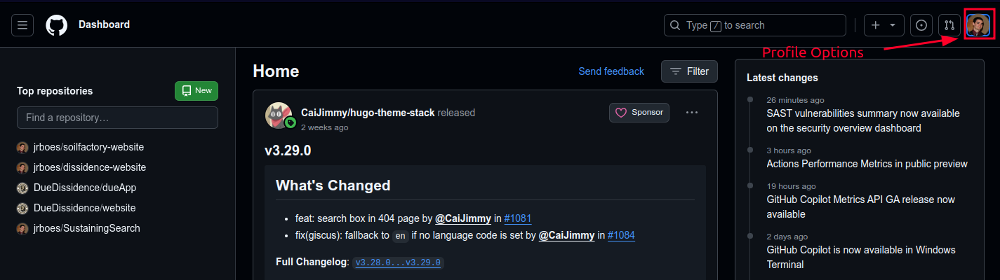
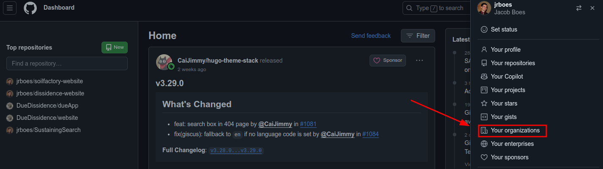
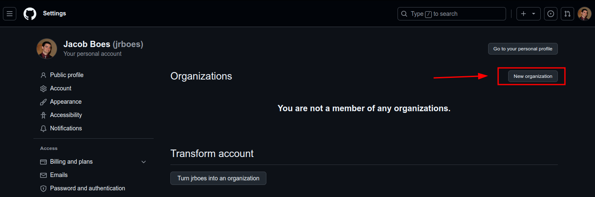
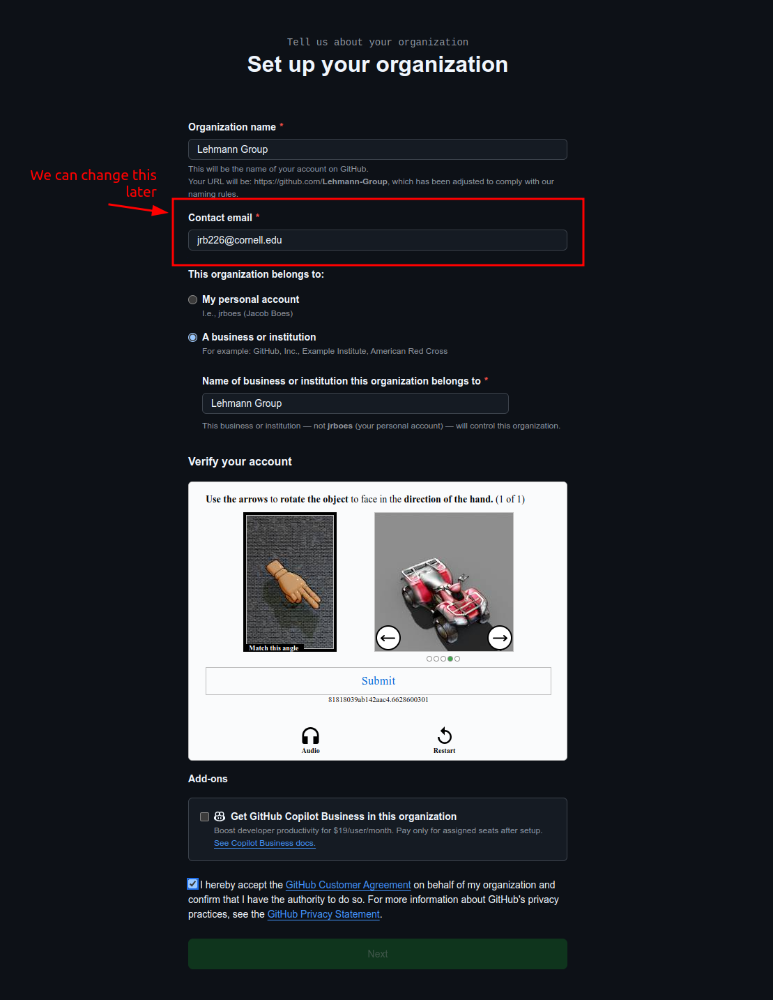
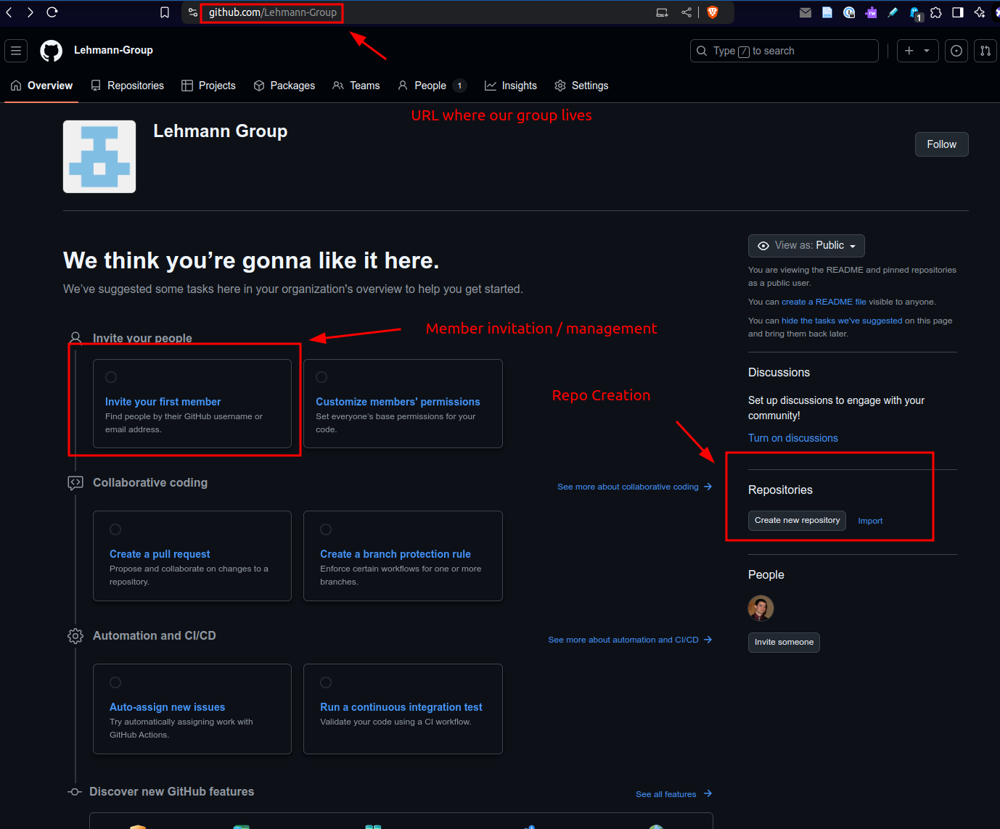
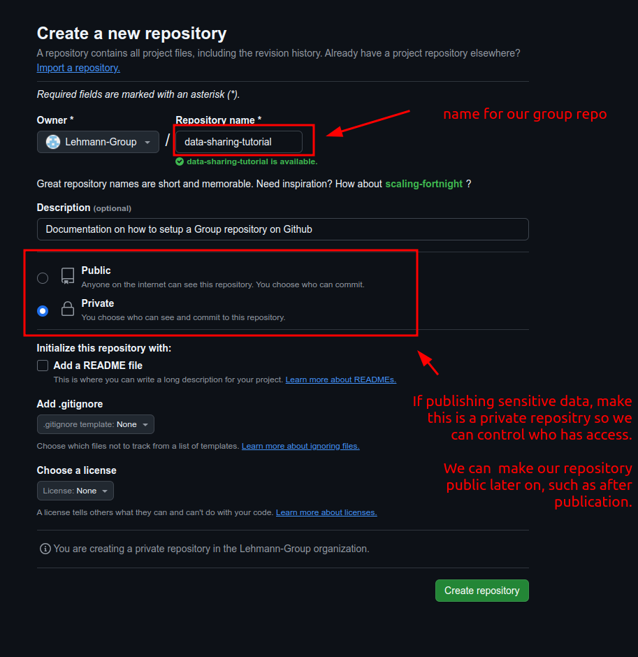
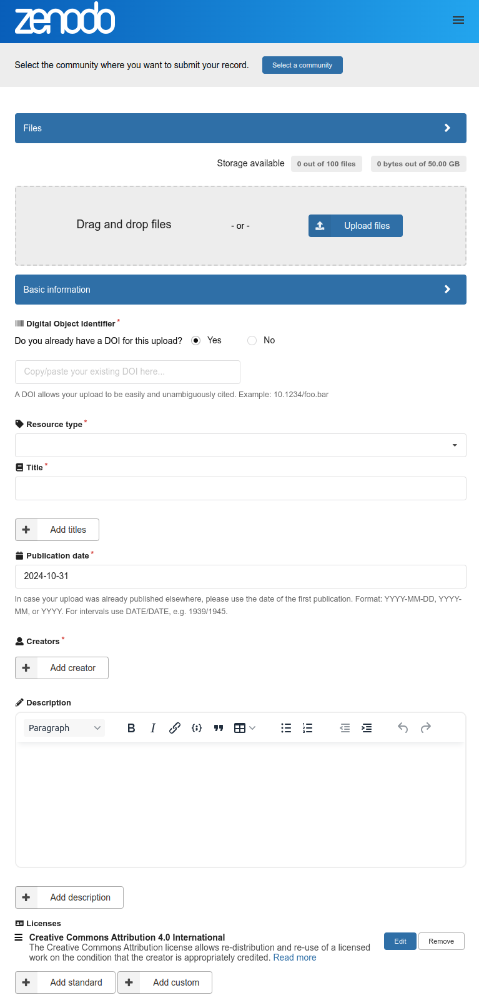

# Data Sharing Tutorial

## Sharing Code and Data via Github
1. Create / sign into a GitHub Account

Go to [Github](https://github.com) and click on Sign in/ Sign up in the upper right hand corner. For account creation, follow the instructions provided.

2. Navigate to the organizations page
Click your profile image in the upper right hand corner of the screen:

Press the "Your organizations" button:

3. (Optional) Start a new organization
Press the new organization button:

Select the organization level you'd like. The free plan is perfectly suitable for academic needs.

Fill out the organizations details:

The contact details for the organization are for billing purposes. It's not public facing and we can change it later in the organizations general settings.

You'll then be prompted to add members to your organization. We can skip this for now. 

Once completed, we'll have access to a general interface which can help point us to where we need to be:

4. Create a repository for your project

Click the "Create new repository" button as shown in the previous image. We can also do this from our personal account and change the owner to whichever group we are a member of.

Then, we need a name for our repository and whether it is public or private.

When sharing sensitive academic data, it's best practice to make these repositories private to start, we can make them public later, such as after publication.

The remaining settings are non-critical and can change it or manually add it later.

5. Add to your repository

Git is a CLI tool independent of Github which as originally designed for software version control. It's a much more powerful tool than most academics need and comes with a steep learning curve.

Github's GUI features can make getting started with Git less arduous. See image below for links to these tools from the creation page:

Using the GUI we can simply interface with the browser the files we want to make available in the repository for sharing with fellow group members. For more advanced users, the CLI is also available.

To learn more about Git try out an [online tutorial](https://www.atlassian.com/git/tutorials).

**Note**: Be aware that due to the version control nature of git, sensitive information removed from the repo is not fully deleted, it still exists as an earlier version in the repo. For 

If our repository is private, we'll also need to give access to those individuals in the group we want to share our repo with as an additional step. Group administrators will be able to access all group repos (see the image above). We can also allow access to teams from the "Settings" tab above, later.

6. Adding data to your repository

Github has size limits to the files you can upload of up to 100 MB. For most projects this will be more than sufficient. However, machine learning projects are often coupled with larger data set, which we will discuss.

It's best practice to store data in a format pared with direction on how to access it. For example, we can make our data available by providing a link to a Google or Microsoft 365 sheet, but as developers this is less convenient than providing an interactive document.

Check out the Jupyter Notebook [in this repo](data-example.ipynb) for a basic example.

## Sharing larger data files.
For data files larger than 100MB, there are some alternatives available to storing directly in a Github repo. We can share a link to a personal oneDrive file, but information can easily be lost once people move on to new positions.

To make large data sharing more permanent, consider hosting using [Zenodo](https://zenodo.org/) or, for published works you can often supply data files to publications. Zenodo is more convenient because it allows for restricted sharing with collaborators even before work is published and can easily be made public after publication in order to streamline the publication process.

Zenodo also offers DOI assignment for data and even Github Repositories. These DOI can then be linked in a manuscript or Jupyter notebook along with instructions on, for example, file placement, in order to allow others to plug and play with your code easily.

Here's a preview of the upload interface after having signed up for an account:

